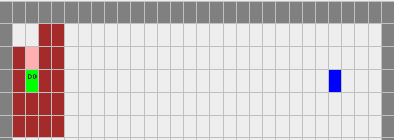
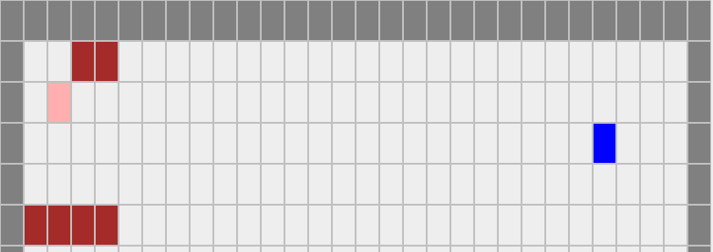
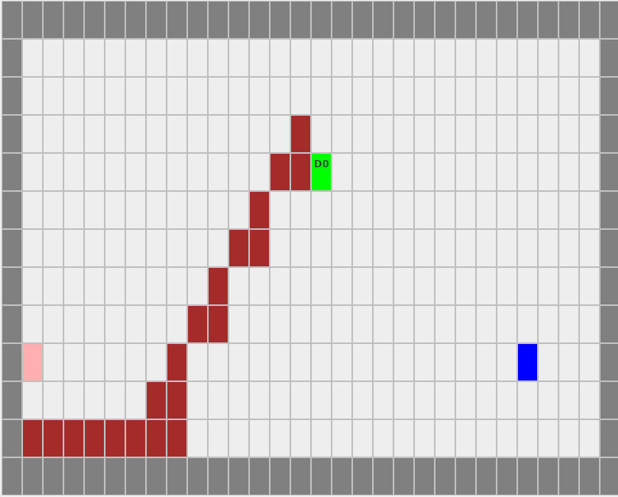

# Exemples
## BOMBER

* BOMBER coincer dans de la dirt  

* BOMBER après avoir explosé  

* En reprenant le même schéma mais avec du metal  

* Le Metal est intact  

## BUILDER

* BUILDER en attente pour construire  

* Après avoir fais sa construction, on le voit bien reprendre son rôle normal et tomber  

* Avec un plafond pour le bloquer  

* Le BUILDER est bien bloqué, il rebrousse chemin et ne continue pas de construire  

